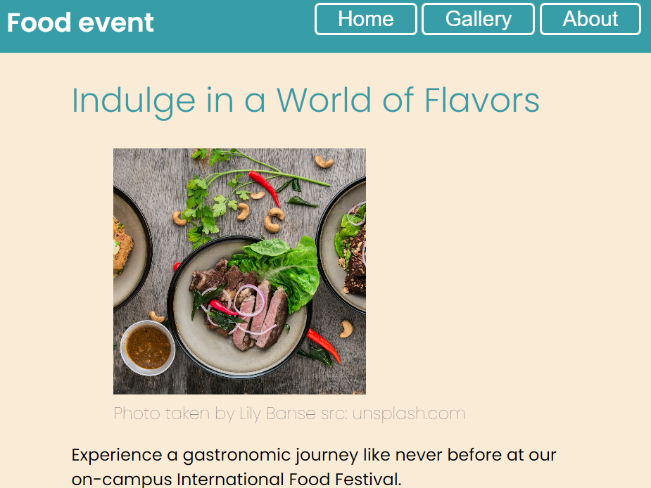
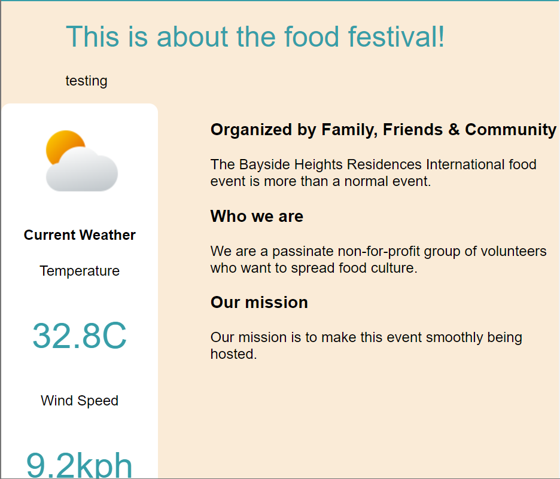
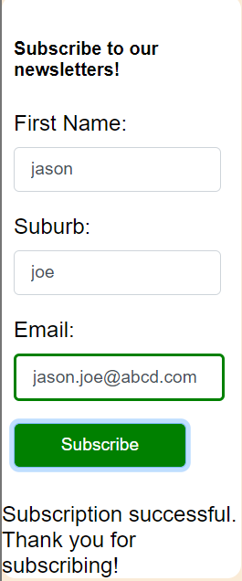

# My-Event-Website

This is  practice website I made during the study of web design (DECO7140) at UQ.
The paragraph contents are generated by AI (ChatGPT).

This  project shows and reflects application of HTML, CSS and Javascript syntax.
Discount button shows a demo function of clicking and showing increasing number.
The weather API shows the real time temperature around UQ great court.
The navigation bar button on top of each page links to different pages.

The subscribption form will show success or error messages based on input data.

